# CogniRogue

**用你的知识爬一座塔。**

一张卡是一张战斗牌，**不是一道题**。牌面只讲机械：费用、类别、效果、数值、等级——
没有主题、没有知识点名、没有题干。点开一张需要答题的知识卡，题和选项才出现，
抽的是**当前这一章的题池**，抽到哪道题这一刻才确定。

答对，这一手按卡面原值结算，并给这张牌攒一次免答；有借书证再退回 1 点行动力。
答错，这一手作废，**但一分行动力都不扣**——代价是本场的新题少一道。

外层是杀戮尖塔那套：一条能提前看见全貌的分支路线、一副越走越厚的牌组、一串整局生效的增益。
TypeScript + Canvas 写的，没有 UI 框架。逻辑层（`src/core`）不碰 DOM，所以同一套规则既能在浏览器里跑，
也能在 Node 里跑几千局无头模拟——仓库里的数值都是模拟出来的，不是拍脑袋定的。

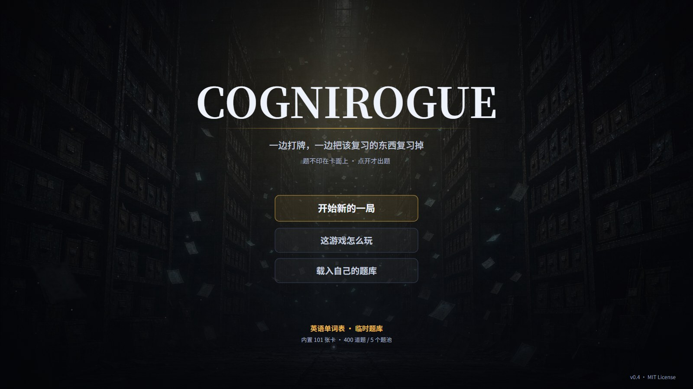

## 快速开始

```bash
git clone <this-repo>
cd CogniRogue
npm install
npm run dev          # http://localhost:5178
npm run build        # 产出 dist/index.html，约 1.8 MB，双击就玩
```

`dist/index.html` 把脚本、样式、美术全部内联，拷到任何地方双击就能玩，不需要服务器、不需要联网。

| 命令 | 作用 |
| --- | --- |
| `npm run dev` | 开发服务器，改代码热更新 |
| `npm run build` | 类型检查 + 依赖方向检查 + 打包成单文件 |
| `npm run check` | 类型检查 + 依赖方向检查（`tools/deps.mjs`） |
| `npm run stage` | 过幕、事件、存档、精英保底的结构检查，不到一秒 |
| `npm run sim` | 无头模拟几千局，验证数值 |
| `npm run smoke` | 开真浏览器点鼠标，验证按钮真的能按（需先跑 `dev`） |
| `npm run shots` | 重拍 `docs/` 里这 24 张配图（同样需先跑 `dev`） |
| `npm run words` | 从词表重生成 `packs/words.md` |

## 文档导航

| 文档 | 写什么 | 什么时候看 |
| --- | --- | --- |
| **README.md** | 玩法、当前数值、题库格式、工程入口 | 第一次打开仓库 |
| **[DESIGN.md](DESIGN.md)** | 机制为什么这样定、哪些东西被删掉、验收标准 | 要改规则、卡牌或增益之前 |
| **[CHANGELOG.md](CHANGELOG.md)** | 按版本记录改动与当时的采样 | 查某个设计是哪一版来的 |
| **[AGENTS.md](AGENTS.md)** | 贡献边界：无后端、无遥测、依赖方向、验证门槛 | 准备提交代码之前 |

## 一局是什么样

**100 层，5 幕，每 20 层一幕。** 每层 2–3 个节点，一幕之内的路开局就全部可见，
你能提前规划"要不要绕去那个复习点"。地图一屏显示 8 层，滚轮或按住拖动可以看更远。
一局 40 场上下、约 150–280 道题，打完 ≈ 一小时。

一局一小时的直接后果是**断点**：每走完一个节点，地图、牌组、血、幕都写进 localStorage
（键 `cognirogue.run.v8`，换格式就抬版本、旧档作废）。只存节点之间，战斗中途的手牌和敌人不存——
关掉标签页不算输。


| 幕 | 场地 | 这一带的规矩 | 幕末 Boss |
| --- | --- | --- | --- |
| 1 | 目录厅 | 什么机制都没有，只教"一张牌 = 一道题" | 编目者 |
| 2 | 虫蛀的借阅区 | 塞杂念、少抽牌——它让你没牌可打 | 饕餮书虫 |
| 3 | 报刊与副本 | 反伤 + 多段轻击——薄刀是在给自己放血 | 压印之主 |
| 4 | 修复室 | 你答错它就叠甲，而且每回合更硬 | 装订之兽 |
| 5 | 禁书区 | 它知道你哪块最弱，每次都往那儿打 | 遗忘 |

每幕的怪是**一整套新物种**（4 普通 / 2 精英 / 1 Boss，共 35 种），不是同一只怪加血。

| 节点 | 内容 |
| --- | --- |
| ⚔ **战斗** | 普通敌人，赢了从三张卡里挑一张进牌组 |
| ☠ **精英** | 血厚、会格挡、会塞杂念。赢了拿一张卡，**再掉一个增益** |
| ✦ **复习** | 休息回 62% 血 / 精炼一张卡（攻挡底数 +3，只改挑中的那张）/ **永久删掉一张卡** |
| ? **事件** | 四段小故事。有的要付代价，有的只是给你一个选择 |
| ✺ **Boss** | 每幕一只，打赢换幕：新图、血回满、上限 +14、再掉一个增益 |

<p align="center"></p>

<p align="center">
  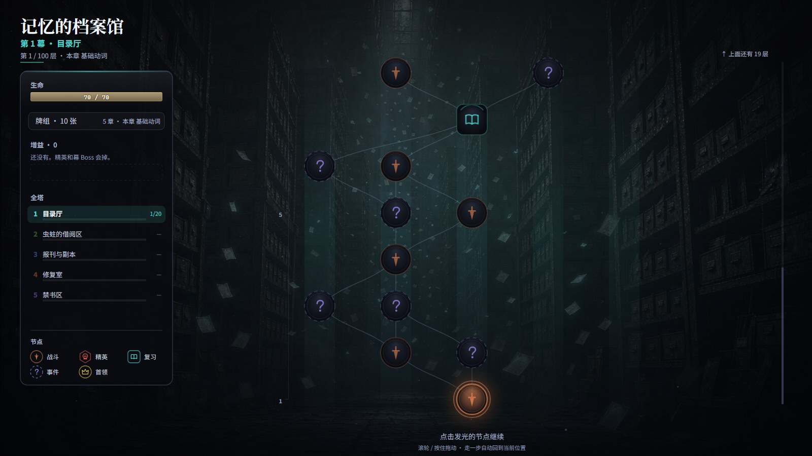
  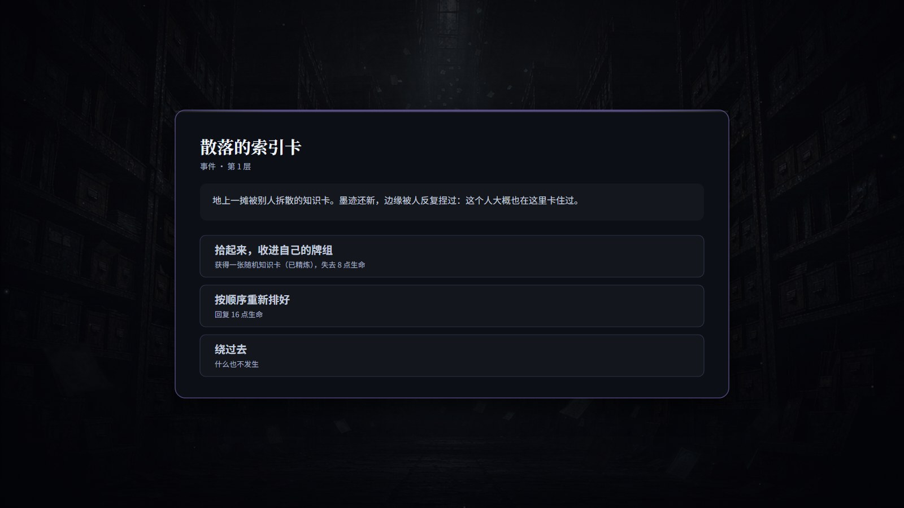
  
</p>

五幕的 Boss 各有一张专属立绘，**体量比普通怪大一圈**（460px vs 400px）——幕末那只必须第一眼就不一样：

<p align="center">
  
  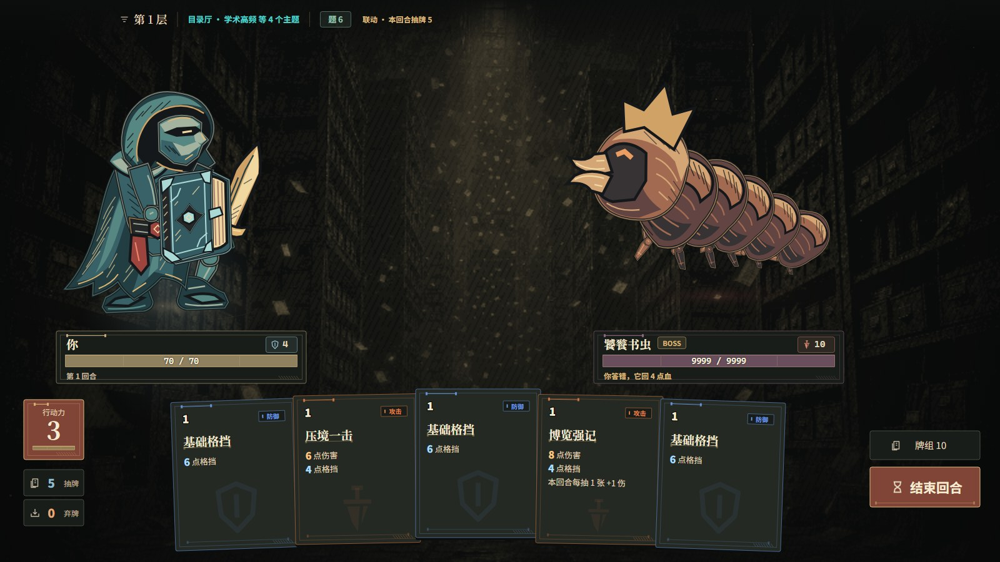
  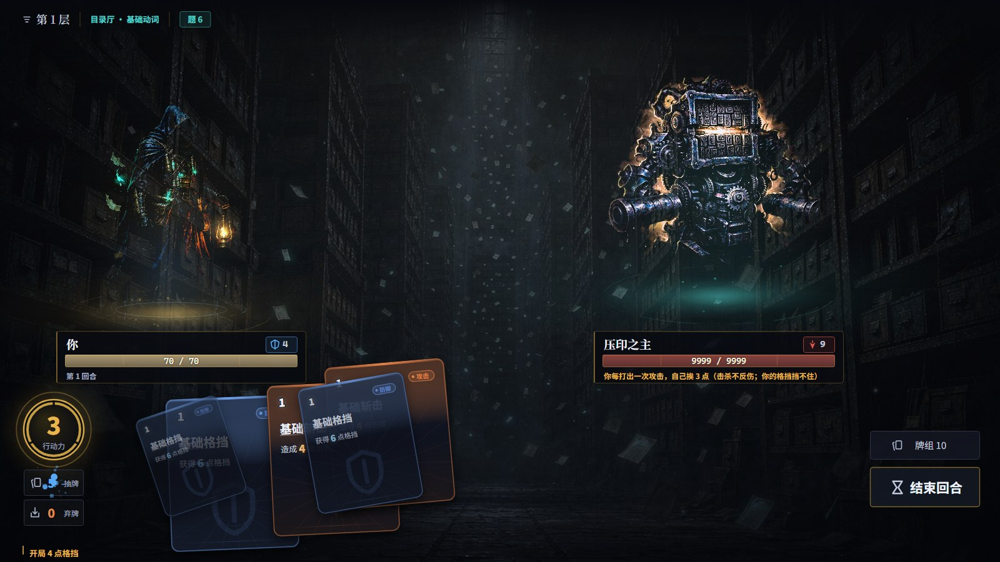
  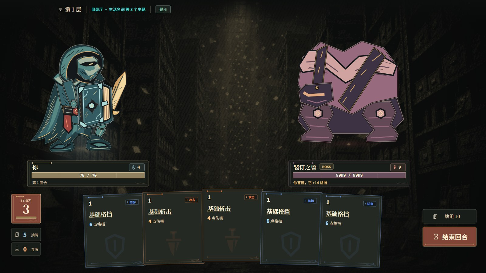
</p>

## 牌

开局 **10 张**：4 张基础斩击（1 费 4 伤）+ 4 张基础格挡（1 费 6 挡）+ 2 张随机知识卡。
每回合抽 5 张。基础牌不答题、随时可打、**无法从游戏中获取**，但可以在复习点精炼或遗忘——
它们是这一局的地板：保证你**不会卡死**，不保证你**打得赢**。

另外 **101 张知识卡**只能从战后奖励和事件里拿。起手那 2 张限定在 C / B 两档（0–1 费），
A / S 只出现在奖励和精英掉落里，否则"开局掷到一张 S 牌"就能平推前十几层。

获取的牌按"干什么"分三类，卡面徽章上直接印着：

| 类别 | 卡 | 它解决什么 |
| --- | --- | --- |
| **攻击** | 猛击 · 洞察 · 串联 · 内化 | 把行动力换成伤害（内化再按伤害回血） |
| **防御** | 巩固 | 把行动力换成格挡（伤害减半、格挡翻倍） |
| **技能** | 专注 | 伤害偏低但抽一张牌——处理"手上没牌了" |

六种效果决定底数怎么花出去，是内置卡牌库里逐张定死的，导入题库改不了：

| 效果 | 机制 |
| --- | --- |
| **猛击** `strike` | 攻 ×1.0，挡 ×0.7 |
| **洞察** `pierce` | 攻 ×0.95，**无视格挡** |
| **巩固** `guard` | 攻 ×0.6，挡 ×2.0 |
| **内化** `drain` | 攻 ×0.85，按伤害 50% 回血 |
| **串联** `chain` | 攻 ×0.52 × **2 段** |
| **专注** `focus` | 攻 ×0.7，**抽 1 张** |

少数牌再挂一层 `mods`（`{ atkMul: 1.2 }`、`{ draw: 2 }`）做签名改动，卡面与结算读同一份。

**卡牌分四级 C / B / A / S。** 等级不是稀有度，是"这张牌这一场要答对几次才免答"：
C 不用答、B 一次、A 两次、S 三次。等级按费用推导（0 费 C、1 费 B、2 费 A、3 费与 X 费 S），
答对一次攒一次，攒满之后这一场它直接打、不再出题，计数每场清零。

**精炼按"张"算，不是按牌名**：牌组里四张基础斩击是四张独立的牌，挑哪张只改哪张，
面板上每份副本各占一格，卡面直接写着"伤 4→7"。精炼过的那张在牌组里带一个 `+`。
唯一的硬底线是**牌组不能删到 4 张以下**。

<p align="center"></p>

## 增益

原来那几件"遗物"。中间做过一版"变成牌"，这一版又收了回来：**精英和幕 Boss 各掉一个，
捡起来就整局生效**——不进牌组、不花行动力、也不需要抽到。右上角那一排就是这一局已经会了什么。

| 增益 | 效果 |
| --- | --- |
| 借 借书证 | 每次答对，退回 1 点行动力 |
| 压 压书石 | 每张牌的伤害 +1 |
| 订 装订线 | 每场战斗第一次答错，伤害和格挡按一半结算 |
| 愿 许愿条 | 整局一次：致死时以 35% 生命活下来 |

池子 **47 个**，按作用域分五档——这也是加新增益时的守门依据（`npm run stage` 会逐张验
"声明了 `always` 的是否真的改了 `rulesOf`"）：

| 作用域 | 多久兑现一次 | 张数 | 加一个要改的地方 |
| --- | --- | --- | --- |
| `always` | 每张牌 / 每回合 | 22 | `powers.ts` 的 `rulesOf` |
| `fight` | 每场一次 | 17 | 结算点调 `onceThisFight(id)` |
| `stage` | 每幕一次 | 2 | 调 `onceThisStage(id)` |
| `run` | 整局一次 | 1 | 调 `onceThisRun(id)` |
| `instant` | 拾取那一刻 | 5 | `powers.ts` 的 `applyInstant` |

完整清单与数值在 `src/core/model/data.ts` 的 `POWERS`，游戏内掉落面板会写清它多久兑现一次。
三条规则把它和牌分开：**不进牌组**（所以面板上没有「不要」）、**不等抽牌**（掉落那刻就生效）、
**整局有效**。不带增益的 800 局是 0/0/2/3，带满是 1/10/19/28——掉落不是锦上添花，是长局的续航。

<p align="center">
  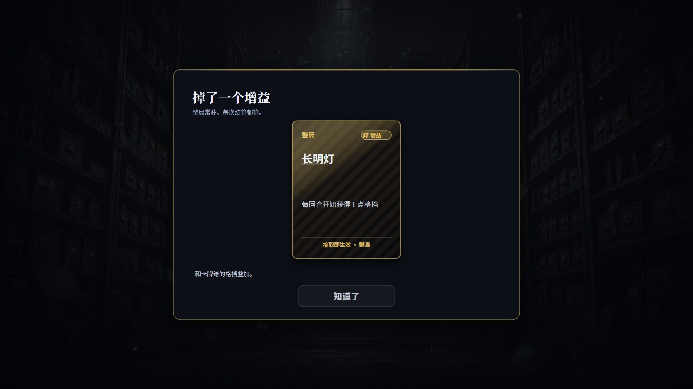
  
</p>

<p align="center">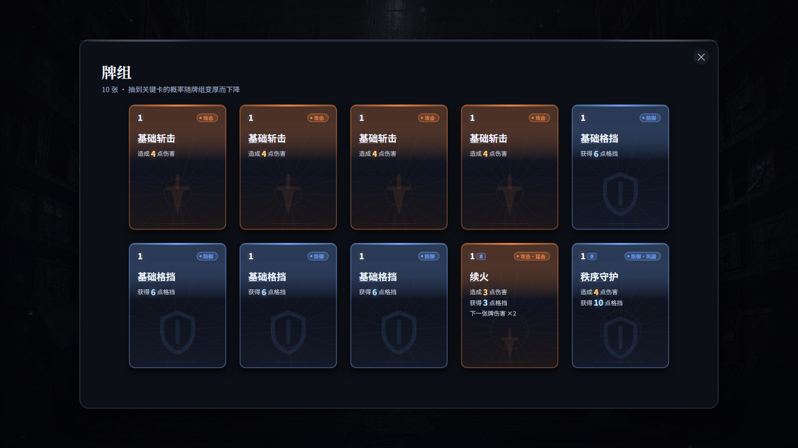</p>

## 一手是怎么走的

```
手牌（类别·效果徽章 + 数值；题不印在卡面上）
  ├ 基础牌 → 点一下直接打：不答题、不退款，4 伤 / 6 挡
  ├ C 级 / 本场已免答的知识卡 → 点一下直接结算
  └ 其他知识卡 → 点一下
             ▼
       答题面板：一道题、2–4 个选项（从当前章的 BANK 抽一道本场没问过的新题）
             │ 答
             ▼
       答对 → 按卡面原值结算；有借书证时退回 1 点
       答错 → 这一手作废，不扣也不退行动力
```

**点开一张需要答题的牌，就是承诺问一道题。** 中途退出只能取消（Esc / 右上角的 ×），
但那道题已经划掉了，取消不是免费换题。

**答对不打断。** 答对走完结算**不弹面板**：光刃、伤害数字、护盾都在战场里发生，
只留一个约一次光刃飞行的输入锁。答错才整屏反馈——正确选项 + 解析，教学时刻在答错那边。

**牌堆循环。** 打出去的牌当场进弃牌堆；回合结束时手里剩下的牌一张不留，全部进弃牌堆
（打不出去的杂念也照进）。弃牌堆平时不动，**只有抽牌堆见底、还要抽牌时**才整堆洗回去。
同名的两张是两份实体，不能因为长得一样就当作"这张牌没动过"。

### 敌人会提前告诉你下一步

这是从杀戮尖塔搬过来最值钱的一条：**意图透明**。每个敌人有固定的招式循环，出招前就能看见：

> 意图：攻击 12×2　/　获得 12 点格挡　/　往你的弃牌堆塞 1 张杂念

于是随机从"被偷袭"变成了"可规划"。几种具体机制：**复习官**一回合内没答对就额外打你 3 点；
**回声 / 镜像**的攻击穿透一半格挡，堆格挡这一套不好使；**熵**往弃牌堆塞杂念（占手牌位、打不出去）；
**审视者**会格挡，想靠一回合爆发带走它得先破甲。

带机制的怪，状态牌第三行（血条下方）常驻一行说明（"你答错，它回 4 点血"）——
机制不靠战斗日志考古，也不该让人打到一半才发现血条在往上走。

### 答错的价码，和开局三个模式

答错只有一种价码，不再由模式决定：这一手**作废**、不出伤害、**不扣行动力**、
**不补格挡、不补抽**（手牌真的少一张）、牌**进弃牌堆**、稳固度 ×0.35。

不扣行动力是明确的选择：错的代价已经落在"本场少一道新题"上，再扣一次等于同一个错误收两次钱，
而且会让人不敢碰不会的知识——正好和这个游戏的目的相反。

**开局选的不是一个单张增益，是一个模式：**

| 模式 | 初始增益 | 个数 | 定位 |
| --- | --- | --- | --- |
| **学习** | 借书证 + 课表 | 2 | 有退款、有基础牌格挡，最稳 |
| **复习** | 借书证 | 1 | 只保留经济地基 |
| **测试** | 无 | 0 | 退款和防御都要靠路上捡，最高难度 |

模式不改答错规则，也不改卡面，只回答一个问题：这一局开局给你几个增益。

<p align="center">
  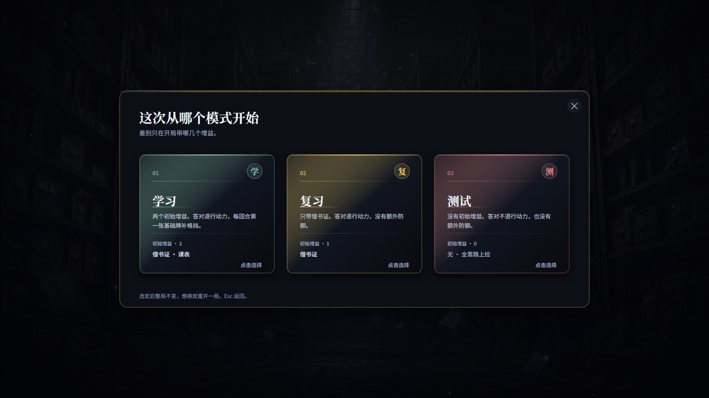
  
</p>

<p align="center">
  
  
</p>

<p align="center">
  
  
  
</p>

<p align="center">
  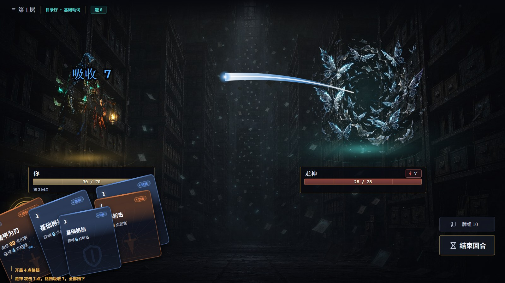
  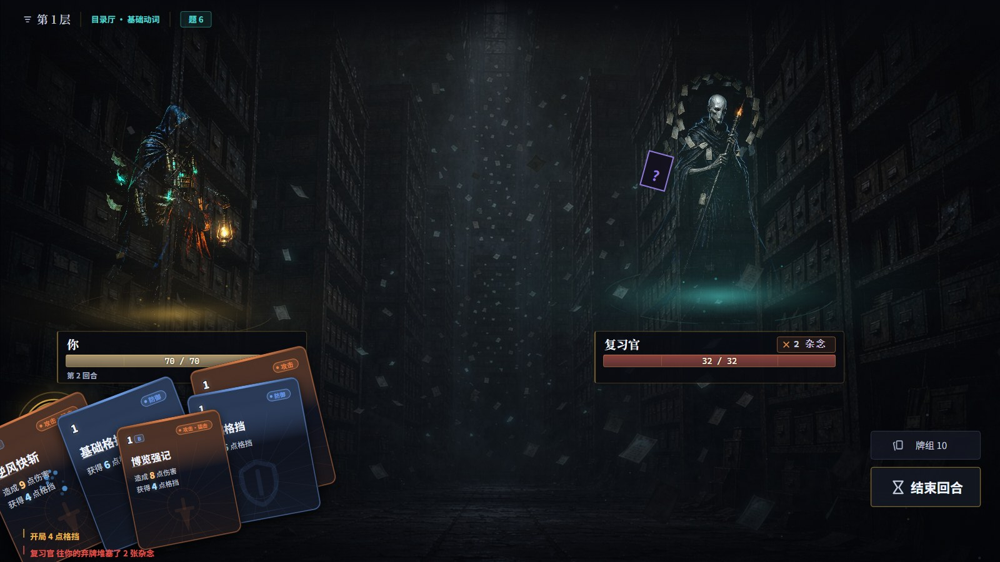
  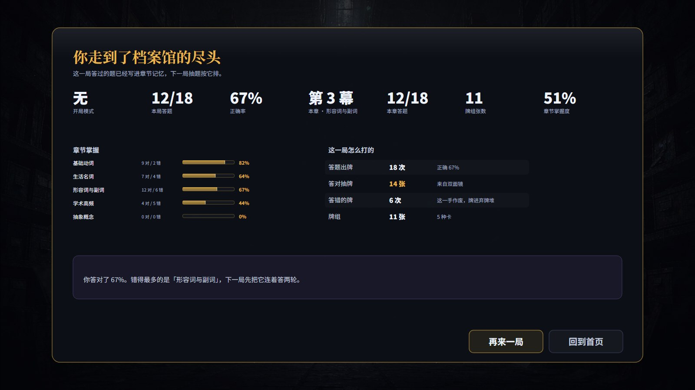
</p>

## 数值是怎么定的

`BAL`（敌人强度、行动力、退款、回血比例）和 `MISS_RULE` 都是模拟出来的。
`npm run sim` 把同一套 `src/core` 打包到 Node 里，默认走**玩家真实路径**：完整五幕、战后拿卡
（牌组到 14 张就停）、血线够就进精英、事件选收益项。

**当前基线：800 局真实路径，1% / 10% / 19% / 28%，四档单调。**
复现用 `SIM_SEED=42 npm run sim -- --runs=800`；不设种子时每格有几个点的漂移，判断"有没有变"要同种子对比。

```
水平     基础正确率   胜率      平均到层    答题/局    答对抽牌/局   答错/局
新手     35%          1%        26.5        152.9      3.6           99.1
入门     55%          10%       45.9        237.2      14.2          106.1
熟练     72%          19%       60.3        277.5      21.6          78.0
精通     88%          28%       67.0        280.4      31.0          33.6
```

关键旋钮：`hp 0.55`、`dmg 1.24`、`hpType 1.10`（只给精英 / Boss 加厚，让 A/S 免答有足够长的
战斗兑现，当前 3.0 次/局）、`baseAp 3`、`drawPerTurn 5`、`restPct 62%`。

**新手 1% 不是回归，是规则形状。** 答错不补垫子也不补抽，低正确率的人两回合就把手牌打空；
一旦基础正确率过 55%，退回的行动力开始滚起来。判据只有一条，写进脚本最后一行自动断言：
**上两档的胜率必须高于下两档**。

几条被反复验证过的结论：行动力只能给 3 点（4 点时不单调）；退款那 1 点是承重墙（`--rf=0` 时全线归零）；
100 层把绝对值整体压低了，嫌难先调 `restPct` 而不是敌人血量——后者会把"挡"变成摆设。

调参不用改源码：`--hp --dmg --ap --hand --rf --take --deck --path=old --mode= --nopow=1` 都能从命令行扫。
推演过程（为什么是开方血线、为什么砍掉免答 ×1.5、历史采样）见 [DESIGN.md](DESIGN.md) 与 [CHANGELOG.md](CHANGELOG.md)。

## 工程结构

`src/core` 是纯逻辑：不 import 任何 DOM / canvas，Node 里能直接跑。七个包**依赖方向单向**，
由 `tools/deps.mjs` 逐条校验：

```
src/core/
  model/     领域模型：共享类型、敌人/增益/数值表、六种效果倍率 —— 无依赖
  infra/     运行时底座：随机数、存档、GameEvent 总线、跨 tick 计时、唯一可变状态 G
  cards/     卡牌：内置卡面表、卡池常量、初始牌组、身份与类别分类、id → 卡面注册表
  library/   知识内容：题库解析/校验、阶段题库、章节记忆、FSRS-lite、选项视图
  map/       一幕 20 层的分支地图：拓扑生成、可达性、100 层层号换算
  combat/    战斗：本场新题池、牌堆循环、敌人回合、出牌（play.ts）、答题结算（answer.ts）
  journey/   一局推进：节点收尾、奖励、事件、结算、开局编排、断点存读
src/gfx/     渲染原语：画布缩放、手绘图标、卡面、飘字、粒子、打击演出
src/scenes/  每个画面一屏：title / map / battle / overlay / report / packio / atlas
src/input.ts 命中区域与点击（含跨帧判定、演出期间的输入锁）
src/main.ts  组合根：主循环、core 事件 → 演出；调试入口在 src/dev/ 下按需加载
tools/       sim / stagecheck / smoke / shots / words / deps
packs/       words.md 是当前内置单词表；algorithms / advanced / systems 保留可导入
```

这条顺序不是口号：combat 不 import journey。战斗只负责标 `G.pending`，journey 在加载时把
`settlePending` 注册成结算钩子，由它决定奖励、换幕还是结算。

一张牌身上有四条互不干扰的轴：**身份**（基础牌 / 知识卡 / 杂念，决定要不要答题）、
**类别**（攻击 / 防御 / 技能，决定徽章与配色）、**效果**（攻挡怎么花）、**主题**（只用于分类统计，
不参与抽题，也不画在牌面上——主题名会提前告诉你考哪块，等于漏一半答案）。

### 调试用的捷径

dev server 的 URL 可以加 `?dev=`（生产单文件没有这个入口）：

| 参数 | 落在哪 |
| --- | --- |
| `?dev=map` / `battle` / `question` / `answer` / `wrong` | 地图 / 战斗 / 答题面板 / 答对一瞬 / 答错一屏 |
| `?dev=boon` / `reward` / `rest` / `event` / `deck` / `help` / `report` / `refine` | 对应弹层 |
| `?dev=event&ev=notebook` | 指定事件（选牌类事件才能测"打开 → 取消"） |
| `?dev=powerdrop` / `power` | 增益掉落面板 / 带着增益上战场 |
| `?dev=foe:atk` / `jam` / `def` / `buff` | 把敌人固定成这一招，配 `cog.endTurn()` 拍动作 |

dev server 还会挂 `window.cog`：`state`、`hots()`（这一帧所有可点区域）、`toScreen()`，
冒烟测试就是靠这三个驱动真实点击的；`cog.strike()` / `cog.enemyAct()` 只放演出、不碰数值。
生产构建不安装 `cog`，也不包含 `?dev=` 分支。

### 为什么是 Canvas

卡牌游戏的核心手感在**连续动画**：手牌扇形排布、抽牌飞入、弃牌飞向牌堆、受击抖动、意图徽章呼吸。
用 DOM 做这套要么上动画库，要么和 CSS transition 的时序打架；Canvas 里这些都是一行 `g.translate`。
代价是**所有交互都要手写命中区域**——这也是本项目唯一出过"看起来正常但完全点不动"的地方，
所以有了下面的冒烟测试。

## 测试

**`npm run sim` 管规则。** 它跑的是 `src/core` 本身，不是复制一份逻辑；改数值、改公式，模拟立刻反映出来。

**`npm run smoke` 管手感。** 真 Chrome + CDP 发真的鼠标按下/抬起，按标签找到按钮点下去，
再断言游戏状态确实变了：标题→选模式→地图→进节点→点手牌→出题→答对→结束回合→掉落→答错→
基础牌→2 费牌→付不起的 3 费牌→X 费牌→复习点→选卡→事件→事件选牌取消→断点→结算重开，一共 **46 步**。

几条专门盯"看起来对但其实是错的"的断言：

- 答对那一步断言**判定面板一帧都没画出来**，再过一步断言它**自己收掉**——否则哪天退回
  "打一下、点一下确认"，手感就废了，而数值断言一条都不会红。
- 答错：不扣行动力、一格挡都不补、不补抽、错牌**进弃牌堆且不回抽牌堆**，连弃牌动画的方向一起钉住。
- 事件选牌取消（点 × 和按 Esc 两条出口）：必须回到事件本身、`pendingCost` 归零、血量一分不动。
- 敌人演出：结束回合时演出单元真的存在且输入被锁，演完之后单元清零、输入解锁、新手牌飞回来。

**`npm run stage`** 管结构：过幕、事件、存档（v8 形状与坏档拒绝）、精英保底、增益作用域。

写冒烟测试是因为踩过一个很隐蔽的坑：命中区域每帧重建，按下时记下的是**上一帧的对象**，
早期版本用 `h === downHot` 判断"是不是同一个按钮"，真实浏览器里几乎每次点击都被判成"手指移出了按钮"——
但截图完全正常，因为截图不点。修法是不比对象、比几何。

## 题库格式

**卡牌库和题库是两样东西，只有后者能从外面换。**

| | 在哪 | 外部能改吗 |
| --- | --- | --- |
| 卡牌库 | `src/core/cards/catalog.ts` | ❌ 101 张卡的卡名、攻挡、效果、id 全部固定 |
| 题库 | `packs/*.md`，或标题页导入的任意 md / JSON | ✅ 只换题目，卡池一个字节不变 |

```markdown
# 我的单词表

## 基础动词

### 单词 "abandon" 的中文意思是？
A) 放弃
B) 借入
C) 修理
D) 聚集
= A
+ abandon 的常见中文释义是「放弃」。
```

| 标记 | 含义 |
| --- | --- |
| `# ` | 题库名（标题页显示），可选 |
| `## ` | **可选**的题池名，任意字符串、数量不限；省略则进「未分类」 |
| `### ` / `? ` | 一道题。`? 理解:` 这类前缀在解析时剥掉，只留题干 |
| `A)` `B)` `C)` `D)` | 选项，**2–4 个** |
| `= X` | 正确答案字母，**必须存在且不越过选项数** |
| `+ ` | 解析，答完显示，可选 |
| `@ ` / `% ` | 旧知识包的卡面行，**现在直接忽略** |

**导入是「全通过或全不动」，但只校验格式。** 缺题干、选项数不对、答案越界，整份拒绝并列出第几行；
主题名、主题数量、每池几道题一概不检查——只有 3 道题的题库也照常载入。

**主题不限，点开牌才绑定题。** 课程表按 `## 主题` 把来源题库切成五章，每幕只从自己那一章抽；
卡面 `topic` 不参与抽题，所以一张「折半之刃」在第一幕问的是「基础动词」的词。某一章不存在时
回退到全部题目，没有哪张牌会变成点不开的死牌。

**选项每次点开都重排**（Fisher-Yates），正确答案索引同步换算到 `G.panel.view`。
写题人给的 `= B` 只是原始位置，照着摆几局之后玩家背下来的就是字母而不是知识。
含「以上都对」这类依赖位置的选项会自动跳过乱序——写题时也别写。

内置题库现在是**临时单词表** `packs/words.md`：5 章 × 80 词 = **400 道题**，
课程表取这五章对应五幕。它是**生成物**：源表在 `tools/words.mjs`，跑 `npm run words` 重写整份题库。
换科目只改 `model/data.ts` 的 `CURRICULUM` 和题库里的 `## 主题` 名，地图、敌人、卡池都不动。

### 用 LLM 写题库

游戏里没有内置调模型的入口（Key 不该经手任何第三方）。把下面这段贴给任意模型，
生成后存成 `.md`，或者在游戏里「载入自己的题库 → 从剪贴板粘贴」：

```text
把下面这段笔记做成一份 CogniRogue 题库，严格按这个格式输出，不要多余的解释。
主题随便起、写几个都行（也可以完全不写 ## 那一行）；每道题的格式必须写全，
否则整份文件会被拒绝载入。

# 题库名

## 主题名

### 一道题的题干？
A) 选项
B) 选项
C) 选项
D) 选项
= B
+ 解析

硬性要求：
1. 同一个主题里的题必须问不同的东西：一道问定义，一道问机制，一道换场景。
2. 干扰项必须是"真的会搞混"的错误，不能是凑数的荒谬项。
3. 解析讲原理，不许复述答案。
4. 不要写「以上都对」这类依赖位置的选项（选项会被打乱）。
5. 不要写 @ 卡名或 % 攻挡效果：卡面是内置的，写了也会被忽略。
6. 每道题 2–4 个选项，必须有 = 答案行，字母不能越过选项数。
```

## 调度：FSRS-lite

每张卡维护一个简化状态 `{ stab, due, reps, lapses }`：答对 `stab` 涨、答错按 ×0.35 掉并置 `due = 1`；
每开一局所有 `due -= 1`。起手**完全不看记忆**，固定 8 张基础牌 + 2 张随机知识卡——
早先按 `due` 排序会让"掌握得越好的卡越不会再出现"。

卡牌记忆只给战斗用（这一场攒了几次免答），不再换算成任何百分比。
章节掌握度是另一份账（`library/stagemem.ts`，按 `topic + qid`），结算页读的是它。
这只是占位实现，**欢迎换成真正的 FSRS**：字段和接口都留好了。

## 美术资源

立绘都是**纯黑底**：绘制时先 `contrast(1.5)` 压成纯黑，再用 `screen` 混合叠上去，黑色直接消失，
只剩发光的轮廓——换立绘不用抠图，也不会有方形色块边缘。想换成自己的图，保持黑底、放进 `assets/`、
改 `FOES` 里的 `art` 字段；换色变体只加一个 `hue` 字段。
UI 图标（剑、盾、骷髅、锁、勾）全部是 Canvas 手画的，不用 emoji——emoji 在不同系统上会变成彩色贴纸甚至方框。
美术由 AI 生成（WorkBuddy / 混元），按 MIT 随项目分发。

## Roadmap

- [x] ~~让"会得多"跑赢"打得狠"~~：赔率改过两轮都对不上，最后把押注整个删掉（v0.3）
- [x] ~~按局选模式~~：学习 / 复习 / 测试只决定开局带哪几个增益；起手牌组固定 10 张
- [x] ~~初始牌组 + 三类牌~~：8 张不可获取的基础牌做保底；可获取的牌分成攻击 / 防御 / 技能
- [x] ~~牌面去知识化~~：主题、知识点名、记忆度全部撤出牌面，颜色改按三类
- [x] ~~题库与卡牌库解耦~~：卡面固化，md 只供题；导入只校验格式、不限制主题
- [x] ~~每 stage 一个 bank~~：课程表切成五章，点开牌时才绑定当前章的题
- [x] ~~选项乱序~~：每次点开用 Fisher-Yates 重排，判定 / 键盘 / 模拟 / 冒烟统一读同一份
- [ ] 真正的 FSRS 实现，替换掉现在的权重
- [ ] 商店节点：现在增益只有精英和幕 Boss 给，构筑的选择还不够密
- [ ] 多敌人战斗：现在一场只有一个敌人，"先杀哪个"的乐趣还没有
- [ ] 跨局累积的掌握曲线：现在只统计本局，应该按章节长期跟踪"第几次才真的记住"
- [ ] 章节题库生成：按 `StageDigest`（正确率 + 错题号）生成下一章题库，再接 RAG / agent
- [ ] 知识图谱：主题之间的前置关系变成 combo 规则
- [ ] 错因诊断：用 LLM 分析"你选了 B，说明你把 X 和 Y 搞混了"
- [ ] 从 Anki / Obsidian / CSV 导入
- [ ] 每日同种子挑战：种子固定就能比对成绩，不需要服务器

## 更新记录

按版本记的改动清单在 [CHANGELOG.md](CHANGELOG.md)：v0.4 是模式 / 初始牌组 / 牌面重做，
v0.3 删掉了押注机制，v0.2 是七包重构与表现层重绘。

## License

MIT。题库内容归各自作者所有。
